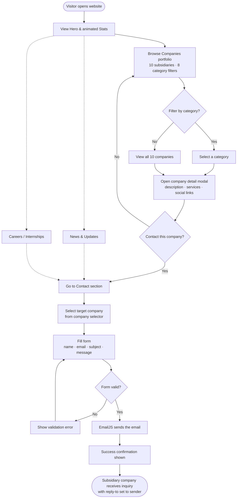
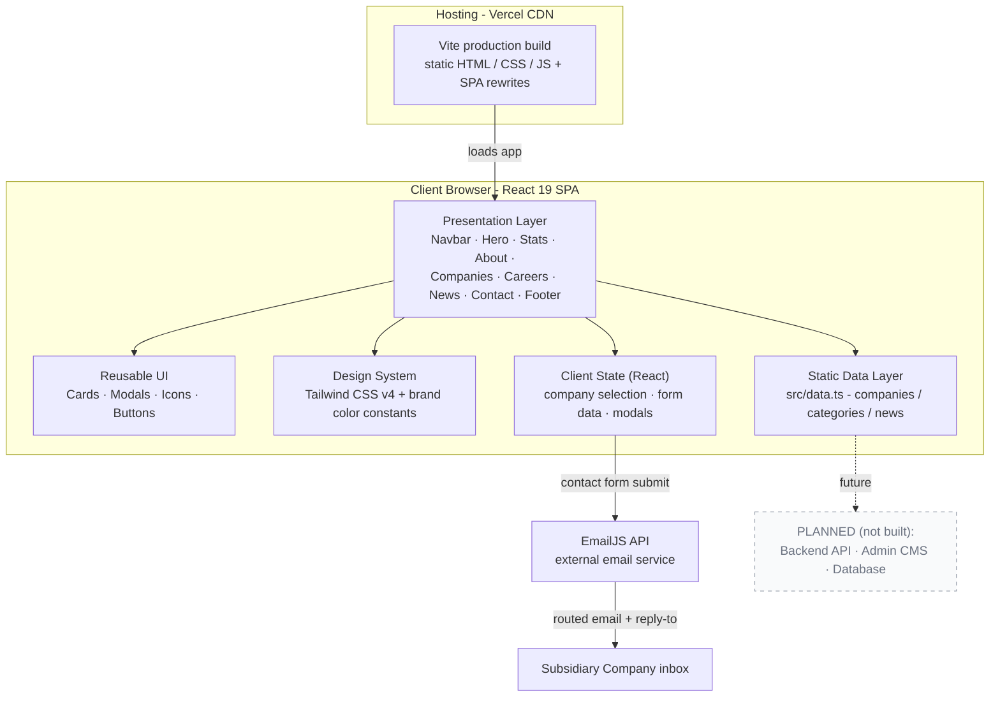
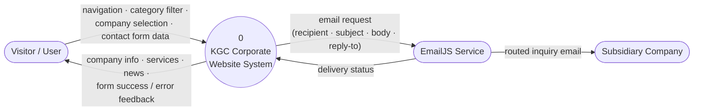
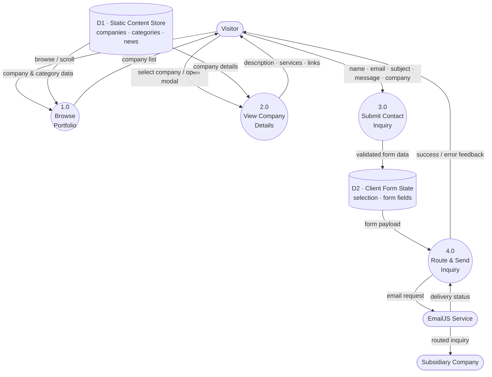
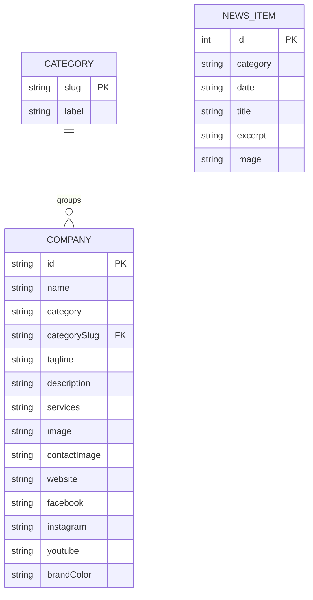

# Klassic Group of Companies — Presentation Diagrams

Project: **Klassic Group of Companies — Corporate Website**
System type: Frontend-only, client-side React SPA (static data + EmailJS). No custom backend or database in the current build.

All diagrams below are written in **Mermaid**. Import them straight into **draw.io** (diagrams.net), then export to PNG/SVG and drop into Canva.

---

## How to import into draw.io

1. Open [app.diagrams.net](https://app.diagrams.net) (or the desktop app).
2. Menu: **Arrange → Insert → Advanced → Mermaid…**
   (or click the **+** toolbar button → **Advanced → Mermaid…**).
3. Paste one Mermaid block below → **Insert**.
4. The diagram is inserted as editable shapes — rearrange as needed.
5. Export: **File → Export as → PNG / SVG** → place into Canva.

> Note: draw.io renders Mermaid nodes as standard boxes. Cylinders (`[( ... )]`), subgraphs, and dashed "Planned" boxes may need a quick restyle after import — the shapes are all editable.

---

## 1. System Flow / Process Flow (Flowchart)

End-to-end user journey: from landing on the site to the inquiry reaching the correct subsidiary.



---

## 2. System Architecture

Frontend-only client-side SPA. The dashed box marks **Planned** components (not yet built).



**ASCII fallback:**

```
                 ┌──────────────────────────────────────────┐
                 │        Hosting — Vercel CDN               │
                 │  Vite build (HTML / CSS / JS + rewrites)  │
                 └───────────────────┬──────────────────────┘
                                     │ serves
                                     ▼
   ┌─────────────────────── Client Browser — React 19 SPA ───────────────────────┐
   │  Presentation Layer (Navbar, Hero, Stats, About, Companies, Careers,         │
   │                      News, Contact, Footer)                                  │
   │        │                                                                      │
   │        ├── Reusable UI (Cards, Modals, Icons, Buttons)                        │
   │        ├── Design System (Tailwind CSS v4 + brand color constants)           │
   │        ├── Client State (React: selection, form, modals)                     │
   │        └── Static Data Layer (src/data.ts: companies/categories/news)        │
   └───────────────────────────────┬─────────────────────────────────────────────┘
                                   │ contact form submit
                                   ▼
                       ┌──────────────────────┐      routed email + reply-to
                       │   EmailJS API        │ ─────────────────────────────►  Subsidiary
                       │ (external service)   │                                  Company inbox
                       └──────────────────────┘
```

---

## 3. DFD — Level 0 (Context Diagram)



---

## 4. DFD — Level 1



---

## 5. ERD — Entity Relationship Diagram

The system has **no database**. These entities are the TypeScript data models backed by static data (`src/data.ts`). The ERD documents the logical data model of the current build.



**Relational schema (text form):**

```
CATEGORY  ( slug PK, label )

COMPANY   ( id PK, name, category, categorySlug FK → CATEGORY.slug,
            tagline, description, services[], image, contactImage,
            website, facebook, instagram, youtube, brandColor )

NEWS_ITEM ( id PK, category, date, title, excerpt, image )
```

**Relationships & notes:**

| Relationship | Type | Via | Notes |
|---|---|---|---|
| CATEGORY → COMPANY | One-to-Many (1:N) | `CATEGORY.slug` = `COMPANY.categorySlug` | One category groups many companies. |
| COMPANY → services | Multi-valued attribute | `services[]` | Stored as an array (e.g. Software Development, IT Consulting). |
| NEWS_ITEM | Standalone entity | — | `category` is free text (e.g. "Company News", "Community", "Career Opportunities") — **not** linked to the CATEGORY entity. |
| Optional attributes | — | — | `contactImage`, `facebook`, `instagram`, `youtube`, `brandColor` may be null/empty. |

**Cardinality summary:**

```
CATEGORY (1) ────< COMPANY (N)        "a category groups many companies"
NEWS_ITEM  ·  standalone (no FK)
```

---

## Brand color reference (for styling the diagrams)

| Token | Hex |
|---|---|
| Gold (primary) | `#C9901A` |
| Gold dark | `#A67C15` |
| Gold light | `#E0B030` |
| Gold tint | `#FDF3DC` |
| Green (secondary) | `#2D6A4F` |
| Green light | `#3D8A65` |
| Dark | `#1C1C1E` |
| Charcoal | `#374151` |
| Slate | `#6B7280` |
| Muted | `#9CA3AF` |
| Border | `#E5E7EB` |
| Surface | `#F9FAFB` |

Suggested diagram styling: nodes = white fill + `#E5E7EB` border + `#1C1C1E` text; accents/arrows = `#C9901A`; "Planned" elements = dashed border + `#9CA3AF`.
